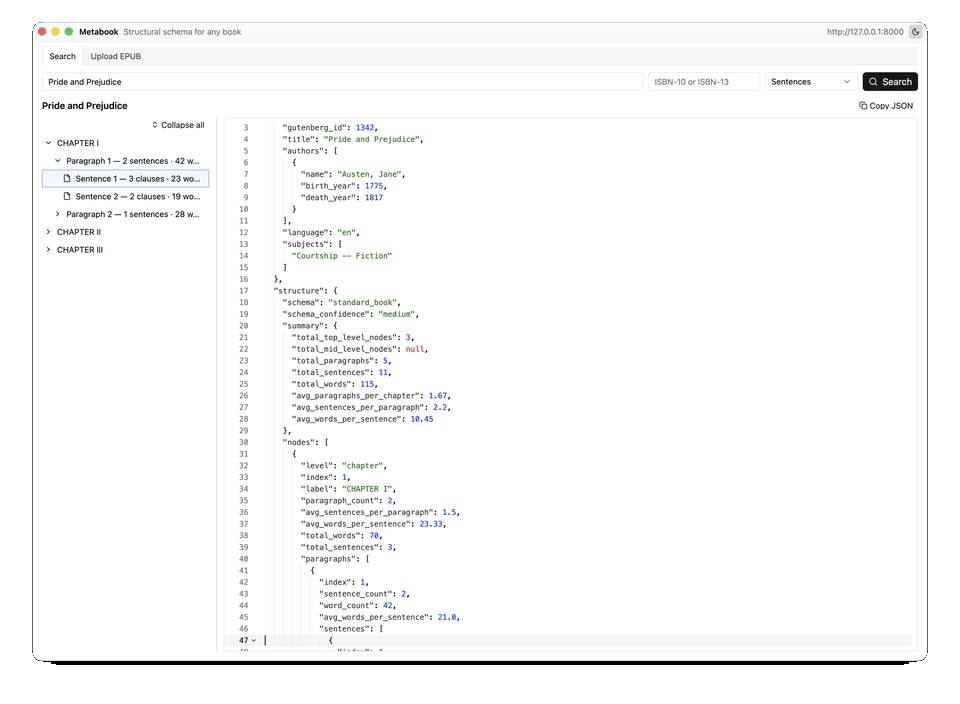
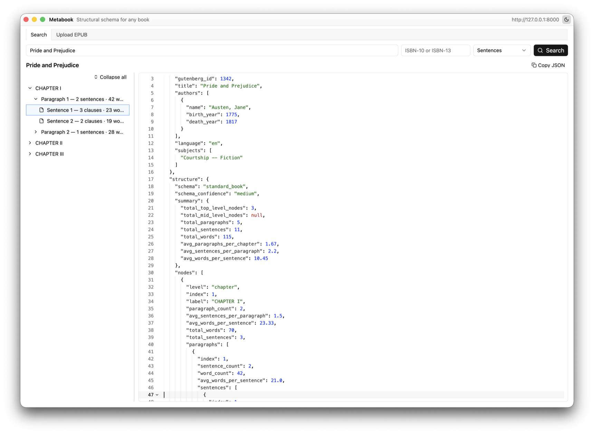
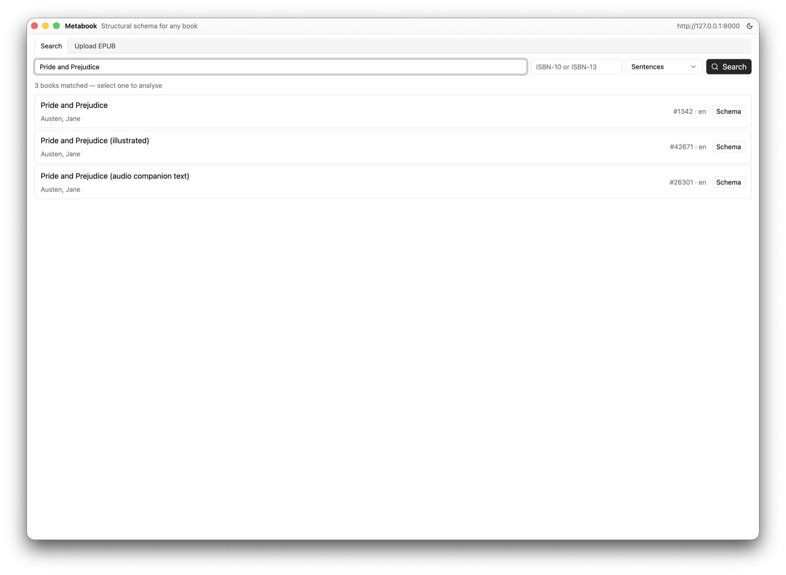
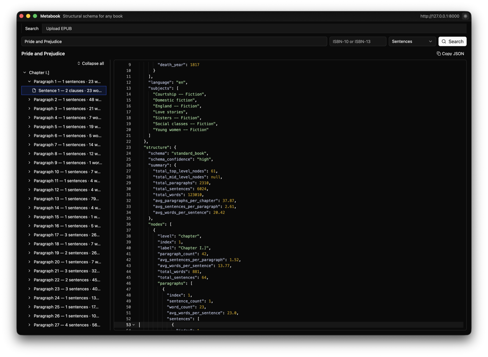

<div align="center">
  <picture>
    <source media="(prefers-color-scheme: dark)" srcset="assets/logo-dark.png">
    <source media="(prefers-color-scheme: light)" srcset="assets/logo-light.png">
    
  </picture>

  # metabook-py

  [](https://github.com/emmanuel-defreitas/metabook-py/actions/workflows/pr.yml)
  [](https://github.com/emmanuel-defreitas/metabook-py/actions/workflows/matrix.yml)
  [](https://github.com/emmanuel-defreitas/metabook-py/releases)
  [](pyproject.toml)
  [](LICENSE)

  **📚 X-ray any book's structure — chapters, paragraphs, sentences, clauses, words — as clean JSON. REST + MCP, Project Gutenberg search or your own EPUB. No book text ever leaves the API.**

  [API docs](#-rest-api) · [MCP server](#-mcp-server) · [Desktop example](#-desktop-example-gpui) · [Workflow](.github/WORKFLOW.md)

  
</div>

---

## Overview

Metabook is a **Book Structure API**: give it a title, an ISBN, a Gutenberg ID, or an EPUB file, and it returns the book's *structural schema* — what kind of book it is and how it's shaped — without ever returning the text itself.

Under the hood it locates the book via [Gutendex](https://gutendex.com) (or walks your uploaded EPUB's spine), downloads and cleans the text, detects the structural schema, and counts everything at every level.

```
title / ISBN / Gutenberg ID ──► Gutendex ──► fetch + clean ──┐
                                                             ├──► detect schema ──► counts-only JSON
your .epub ──► Vercel Blob ──► package doc + spine XHTML ────┘
```

## ✨ Features

- **🔍 Fuzzy search** — find books by title or author via Gutendex, or go straight to an ISBN / Gutenberg ID
- **🧬 Schema detection** — classifies each book as `scripture`, `sectioned_book`, `standard_book`, `essay_collection`, or `flat`, with a confidence rating
- **🔢 Counts, not content** — chapters, paragraphs, sentences, clauses, and words per node; a word node is just its index. **No book text is ever included in a response**
- **📤 Bring your own EPUB** — `POST /api/books/upload` stores the file in Vercel Blob and analyses it with the same pipeline
- **🔌 Two interfaces, one service layer** — a FastAPI REST API and a FastMCP server share the same core
- **🖥️ Native desktop client** — a GPUI example app with an animated structure tree and a synced JSON code editor

### Detail levels

The `detail` parameter controls how deep the returned tree nests beneath each paragraph:

| `detail` | Nested nodes |
|----------|-----------------------------------------|
| `paragraph` | paragraphs only (counts for the rest) |
| `sentence` | + sentence nodes |
| `clause` | + clause nodes |
| `word` | + word nodes (index + position only) |

### Token counts

Pass an optional `tokenizer` query parameter naming a Hugging Face tokenizer
repository (e.g. `bert-base-uncased`) and every node in the tree carries a
token count alongside its word count — special tokens excluded, so parent
totals equal the sum of their children. The response metadata echoes the
resolved tokenizer name and its vocabulary size. The tokenizer is fetched
lazily on first use (cached on disk and in memory afterwards); an unknown
name returns `422`, a transient fetch failure on cold start returns `503`.
When the parameter is omitted, no token counts are computed and the response
is unchanged.

```bash
curl "http://127.0.0.1:8000/api/books/structure?title=Pride+and+Prejudice&tokenizer=bert-base-uncased"
```

## 🚀 Quick start

```bash
make setup              # install dependencies (uv sync)
make dev                # run the API with auto-reload on :8000
make test               # run the test suite
make docker-up          # or run it via docker compose
```

Then open the interactive docs at [`http://127.0.0.1:8000/api/docs`](http://127.0.0.1:8000/api/docs), or try:

```bash
curl "http://127.0.0.1:8000/api/books/structure?title=Pride+and+Prejudice&detail=sentence"
```

### EPUB uploads

Uploads need a Vercel Blob read-write token in the environment (or `.env` / `.env.local`):

```bash
export BLOB_READ_WRITE_TOKEN=vercel_blob_rw_...
```

If the project is linked to Vercel, `vercel env pull` writes the token to `.env.local` (gitignored), which the app loads automatically — values there override `.env`.

### Uploads collection (MongoDB, optional)

Every book a user uploads or selects from search results is persisted as a
document in a MongoDB `uploads` collection: the book metadata, format
(`epub`), the Vercel Blob link, and the scan state (scanned yet, last
scanned, scope, schema, total token count). The structure tree itself is
never stored. Set `MONGODB_URI` to enable (empty = disabled, no behavior
change); re-selecting the same Gutenberg book updates its document instead
of duplicating it:

```bash
export MONGODB_URI=mongodb://localhost:27017
```

Browse what's stored via `GET /api/books/uploads`.

## 🌐 REST API

| Method | Endpoint | Purpose |
|--------|----------|---------|
| `GET` | `/api/books/structure` | Analyse by `title`, `isbn`, or `gutenberg_id` (+ `detail`, `tokenizer`) |
| `GET` | `/api/books/structure/schemas` | List the supported structural schemas |
| `POST` | `/api/books/upload` | Upload an EPUB and analyse it |
| `GET` | `/api/books/uploads` | List persisted upload documents (needs `MONGODB_URI`) |
| `GET` | `/health` | Liveness + cache stats |

Interactive OpenAPI docs live at `/api/docs`.

## 🤖 MCP server

A [FastMCP](https://gofastmcp.com) server is mounted at `/mcp`, so agents can use the same service layer through three tools:

| Tool | Description |
|------|-------------|
| `search_book_structure` | Analyse a book by title, ISBN, or Gutenberg ID |
| `upload_book_epub` | Analyse an EPUB passed as base64 or a URL |
| `list_supported_schemas` | Enumerate the structural schemas |

## 🖥️ Desktop example (GPUI)

[`example/`](example) is a native macOS client built with [GPUI](https://www.gpui.rs) and [gpui-component](https://github.com/longbridge/gpui-component): fuzzy search or EPUB upload, an animated lazily-materialised structure tree, and a read-only JSON code editor (tree-sitter highlighting, folding) that scrolls to and highlights whichever node you select in the tree. Light and dark themes, spring animations, routed form transitions.

<div align="center">
  <picture>
    <source media="(prefers-color-scheme: dark)" srcset="assets/screenshot-dark.png">
    <source media="(prefers-color-scheme: light)" srcset="assets/screenshot-light.png">
    
  </picture>
</div>

<details>
<summary>More screenshots</summary>

| Search results | Dark mode |
|---|---|
|  |  |

</details>

Run it (API first, then the app):

```bash
make dev
```

```bash
cd example && cargo run
```

See [`example/README.md`](example/README.md) for the `Metabook.app` bundle (with app icon) and `METABOOK_API` configuration.

## 🌳 Branching and release

CI/release pipeline scaffolded from [exegia/corpora-py](https://github.com/exegia/corpora-py): same branch model, GitHub Actions workflows, composite actions, and `make`-driven release automation.

See [`.github/WORKFLOW.md`](.github/WORKFLOW.md) for the full branch model, versioning rules, and workflow reference. Quick summary:

```
<type>/<slug> --PR--> dev --(daily/manual)--> next --cut--> release/vX.Y.Z --draft PR--> main
                 (deleted on merge)         (preview)                       (deleted on release)
```

### Common commands

```bash
make help                # list all targets
make ci                  # everything CI runs on a PR (lint + test)
make pack                # build the publishable wheel
make rulesets-diff       # rulesets GitHub currently has
make rulesets-apply      # push .github/rulesets/*.json
```

### Bootstrap

There are no `dev` / `next` branches until the first wrapup. Run the **Release** workflow manually (`Actions → Release → Run workflow`), or locally:

```bash
make bootstrap-lanes
```

## 📄 License

[MIT](LICENSE) © Emmanuel De Freitas
